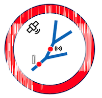

<!-- Header block for project -->
<hr>

<pre align="center">Official documentation website for RAPID - Routing Application for Parallel computatIon of Discharge</pre>

<!-- Header block for project -->

[](https://www.mkdocs.org/) [](https://squidfunk.github.io/mkdocs-material/) [](https://nasa-ammos.github.io/slim/)



This repository contains the source code for the RAPID documentation website, built with MkDocs and Material theme. The website provides comprehensive documentation for RAPID, an advanced river network routing model used for high-performance computing of water flow and volume across thousands of river reaches.

[Live Website](https://c-h-david.github.io/rapid-hub) | [RAPID Repository](https://github.com/c-h-david/rapid2) | [Issue Tracker](https://github.com/c-h-david/rapid-hub/issues)

## Features

* **Simple MkDocs Setup**: Streamlined configuration that's easy to build, edit, and deploy
* **Offline Capable**: All assets served locally for development and deployment flexibility
* **Code-Based Architecture Diagrams**: Uses Mermaid.js diagrams that can be edited directly in code

## Contents

* [Quick Start](#quick-start)
* [Build Instructions](#build-instructions)
* [Development](#development)
* [Deployment](#deployment)
* [Content Structure](#content-structure)
* [Contributing](#contributing)
* [License](#license)
* [Support](#support)

## Quick Start

This guide provides a quick way to build and serve the documentation website locally.

### Requirements

* Python 3.8+
* Git
* Modern web browser for testing

### Setup Instructions

1. **Clone the repository**
   ```bash
   git clone https://github.com/c-h-david/rapid-hub.git
   cd rapid-hub
   ```

2. **Create virtual environment** (recommended on macOS)
   ```bash
   python3 -m venv venv
   source venv/bin/activate  # On Windows: venv\Scripts\activate
   ```

3. **Install dependencies**
   ```bash
   pip install mkdocs mkdocs-material mkdocs-macros-plugin
   ```

#### Alternative Setup with UV (Optional)

If you prefer using UV package manager:

1. **Install UV package manager**
   ```bash
   curl -LsSf https://astral.sh/uv/install.sh | sh
   ```

2. **Install dependencies using UV**
   ```bash
   uv pip install mkdocs mkdocs-material mkdocs-macros-plugin
   ```

### Run Instructions

1. **Start the development server**
   ```bash
   mkdocs serve
   ```

2. **Open in browser**
   - Navigate to `http://127.0.0.1:8000` 
   - The site will automatically reload when you make changes to the documentation

3. **Expected output**: You should see the RAPID documentation homepage with navigation, institutional logos, and responsive design.

## Build Instructions

### Production Build

1. **Generate static site**
   ```bash
   mkdocs build
   ```
   
   This creates a `site/` directory with all static files ready for deployment.

2. **Verify build output**
   ```bash
   ls site/
   # Should show: index.html, user-guide/, developer-guide/, about/, assets/, etc.
   ```

### Clean Build

1. **Remove previous build artifacts**
   ```bash
   rm -rf site/
   ```

2. **Rebuild from scratch**
   ```bash
   mkdocs build --clean
   ```

## Development

### Local Development Workflow

1. **Start development server with live reload**
   ```bash
   mkdocs serve --dev-addr=127.0.0.1:8000
   ```

2. **Edit documentation files** in the `docs/` directory
   - Markdown files automatically trigger rebuilds
   - CSS/JS changes require manual refresh

3. **Test across devices** using browser developer tools or local network access:
   ```bash
   mkdocs serve --dev-addr=0.0.0.0:8000
   ```

### Content Management

- **Pages**: Edit Markdown files in `docs/`
- **Navigation**: Update `mkdocs.yml` nav section
- **Styling**: Modify `docs/stylesheets/extra.css`
- **Images**: Add to `docs/imgs/`
- **Configuration**: Edit `mkdocs.yml`

## Deployment

### GitHub Pages (Recommended)

1. **Enable GitHub Pages** in repository settings
   - Source: Deploy from a branch
   - Branch: `gh-pages`

2. **Deploy using MkDocs**
   ```bash
   mkdocs gh-deploy
   ```
   
   This builds the site and pushes to the `gh-pages` branch automatically.

### Manual Deployment

1. **Build the site**
   ```bash
   mkdocs build
   ```

2. **Deploy to web server**
   ```bash
   rsync -avz site/ user@server:/path/to/website/
   ```

## Content Structure

```
docs/
├── index.md                    # Homepage
├── user-guide/               # User documentation
│   ├── quick-start.md
│   ├── getting-started/
│   └── tutorials/
├── developer-guide/          # Developer documentation  
│   ├── architecture.md
│   ├── code.md
│   ├── contributing.md
│   └── testing.md
├── about/                    # Project information
├── imgs/                     # Images and logos
├── stylesheets/             # Custom CSS
└── js/                      # JavaScript files
```

## Contributing

Interested in contributing to our documentation? Please see our: [Contributing Guide](docs/developer-guide/contributing.md)

### Quick Contribution Steps

1. Create a GitHub issue describing your proposed changes
2. [Fork](https://github.com/c-h-david/rapid-hub/fork) this repository
3. Make your modifications in your fork
4. Test locally using `mkdocs serve`
5. Submit a pull request with your changes

For guidance on how to interact with our team, please see our [Code of Conduct](https://github.com/c-h-david/rapid2/blob/main/CODE_OF_CONDUCT.md)

## License

See our: [LICENSE](LICENSE)

The RAPID software is licensed under the Berkeley Software Distribution 3-clause license.

## Support

For questions about the documentation website:
- **Issues**: [GitHub Issues](https://github.com/c-h-david/rapid-hub/issues)
- **RAPID Software**: [RAPID Repository](https://github.com/c-h-david/rapid2)
- **Getting Help**: [Documentation](docs/about/getting-help.md)

Key points of contact:
- Documentation: [@c-h-david](https://github.com/c-h-david) 
- RAPID Development Team: [RAPID Contributors](https://github.com/c-h-david/rapid2/graphs/contributors)
