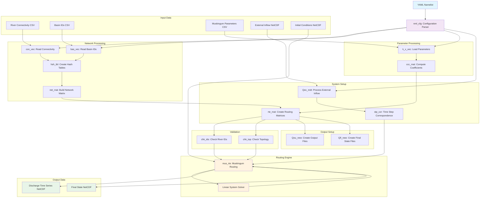
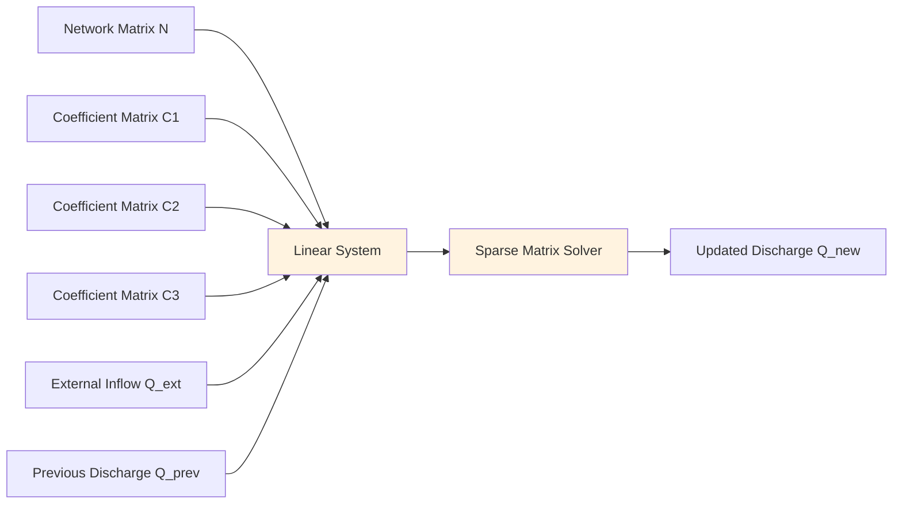

# Architecture

## Overview of Software Architecture

RAPID is implemented as a Python package with a modular architecture that separates river network processing, parameter handling, routing computations, and I/O operations. The system follows a pipeline architecture where data flows through distinct processing stages.

## System Architecture Diagram

## System Components

### Core Modules

#### Configuration Management
- **`nml_cfg.py`** - YAML namelist parser and validator that loads configuration files and validates required parameters

#### River Network Processing
- **`con_vec.py`** - Reads river connectivity data from CSV files
- **`bas_vec.py`** - Loads basin/sub-basin river ID mappings  
- **`hsh_tbl.py`** - Creates hash tables for efficient river ID lookups
- **`net_mat.py`** - Constructs network connectivity matrices
- **`chk_ids.py`** - Validates river ID consistency between datasets
- **`chk_top.py`** - Verifies upstream-downstream topology

#### Parameter Management
- **`k_x_vec.py`** - Loads Muskingum k and x parameters for each river reach
- **`ccc_mat.py`** - Computes Muskingum coefficient matrices (C1, C2, C3)

#### Routing Engine
- **`rte_mat.py`** - Constructs routing matrices for the linear system
- **`mus_rte.py`** - Performs matrix-based Muskingum routing calculations
- **`stp_cor.py`** - Handles time step correspondence between input data and routing

#### I/O Operations
- **`Qex_mdt.py`** - Reads external inflow metadata and data
- **`Qou_new.py`** - Creates output discharge files
- **`Qfi_new.py`** - Creates final state files

### Main Application
- **`_rapid2.py`** - Main entry point that orchestrates the entire routing workflow

## Data Flow Architecture

The RAPID system follows this processing pipeline:

1. **Configuration Loading**: Parse YAML namelist and validate parameters
2. **Network Setup**: Load river connectivity and create network matrices
3. **Parameter Loading**: Read Muskingum parameters and create coefficient matrices
4. **System Matrix Assembly**: Construct linear system matrices for routing
5. **Input Processing**: Load external inflow data and initial conditions
6. **Validation**: Check ID consistency and network topology
7. **Output Setup**: Create output files with proper metadata
8. **Routing Loop**: Perform time-stepping Muskingum routing
9. **Results Storage**: Save discharge time series and final states

## Mathematical Foundation

RAPID implements a matrix-based version of the Muskingum routing method:

- **Network Matrix**: Represents upstream-downstream relationships
- **Coefficient Matrices**: C1, C2, C3 from Muskingum parameters
- **Linear System**: Sparse matrix system solved at each time step
- **Time Stepping**: Iterative solution through multiple routing time steps

## Extension Points

### Adding New Input Formats
- Extend I/O modules to support additional file formats
- Implement new metadata parsers following existing patterns

### Custom Routing Methods
- Modify `mus_rte.py` or create new routing modules
- Adjust matrix construction in `rte_mat.py` for new methods

### Enhanced Validation
- Add new validation modules following `chk_*.py` patterns
- Integrate additional consistency checks into the main workflow

## Design Patterns

### Functional Programming
- Each module provides pure functions with clear inputs/outputs
- Minimal side effects and state management
- Extensive use of NumPy arrays and SciPy sparse matrices

### Pipeline Architecture
- Clear separation of concerns between processing stages
- Data transformation through sequential module calls
- Error handling at module boundaries

### Configuration-Driven
- All file paths and parameters specified in YAML configuration
- No hardcoded paths or parameters in the codebase
- Flexible input/output file specification

## Technology Stack

### Core Dependencies
- **NumPy**: Array operations and numerical computations
- **SciPy**: Sparse matrix operations and linear algebra
- **NetCDF4**: Scientific data file I/O
- **PyYAML**: Configuration file parsing

### Development Tools
- **Type Hints**: Full typing support for maintainability
- **Docstrings**: Comprehensive function documentation with examples
- **Testing**: Unit tests using doctest examples

---

For detailed API documentation and implementation details, please refer to the [source code](https://github.com/c-h-david/rapid2) and the individual module docstrings.
